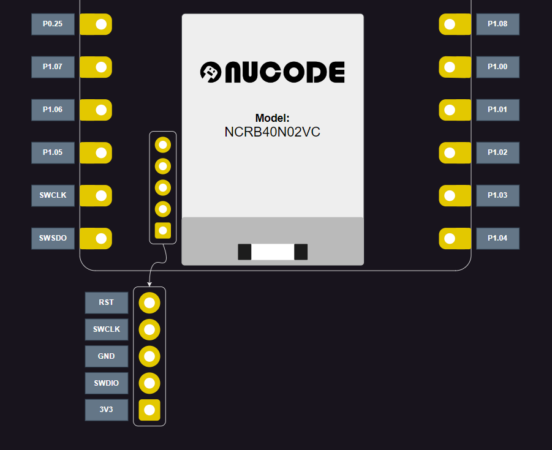

# NUBOOT Flashing Guideline Using J-Link

This document provides a step-by-step guide to flash NUBOOT using J-Link.

## 📋 Prerequisites
### 🛠️ Hardware
- [J-Link debug probes](https://www.segger.com/products/debug-probes/j-link/)
- NU40-B-Dev02 Development Kit
### 💻 Software
- [nRF Programmer](https://github.com/NordicSemiconductor/pc-nrfconnect-programmer) (The  app is installed from nRF Connect from Desktop. For detailed steps, see [Installing nRF Connect for Desktop apps](https://docs.nordicsemi.com/bundle/nrf-connect-desktop/page/installing_apps.html) in the nRF Connect from Desktop documentation.)
- [Pre-Built nuboot for NU40-B-Dev02](https://1drv.ms/u/c/627b42b43520055e/EefVGueSW5FLoP6GIpjPqb8B0PuorMDGgyahXtgeuOZFXg?e=pcKoLJ)

## ⏭️ Steps to Flash NUBOOT

1. **Connect J-Link to NU40-B-Dev02**
    - Connect J-Link to NU40-B-Dev02 over the SWD port following the picture below:
  
  

    - Double-check that the wiring connections are correct, particularly the GND and VCC.
    - Plug J-Link to your computer.
    - Verify that the power LED (LED5) is on.

1. **Launch nRF Programmer**
    - Open the Programmer from *nRF Connect for Desktop* software on your computer.
    - Select the target device from the list of connected devices.

2. **Load NUBOOT Firmware**
    - In the nRF Programmer software, click on "**Add file**" and navigate to "**Browse..**".
    - Browse to the location of the NUBOOT firmware file and select it.

3. **Flash the Firmware**
    - Click on the "**Erase & write**" button in the nRF Programmer software to start the flashing process.
    - Wait for the process to complete.

4. **Verify the Flashing Process**
    - After the flashing process completes, confirm that the firmware has been successfully flashed by following these steps:
        - Press and hold button S1.
        - While holding button S1, press the reset button.
        - Check if LED1 turns on, which indicates that the device has entered recovery mode successfully.

## 🛠️ Troubleshooting

- **Connection Issues**
  - Ensure that the J-Link hardware is properly connected to the target device.

## 📚 Additional Resources

For further assistance, please contact support.
