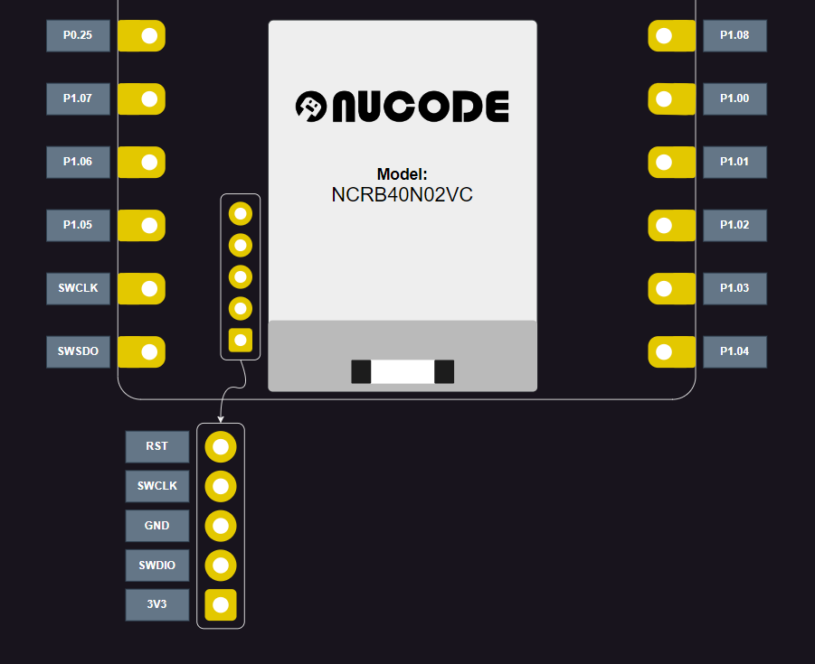
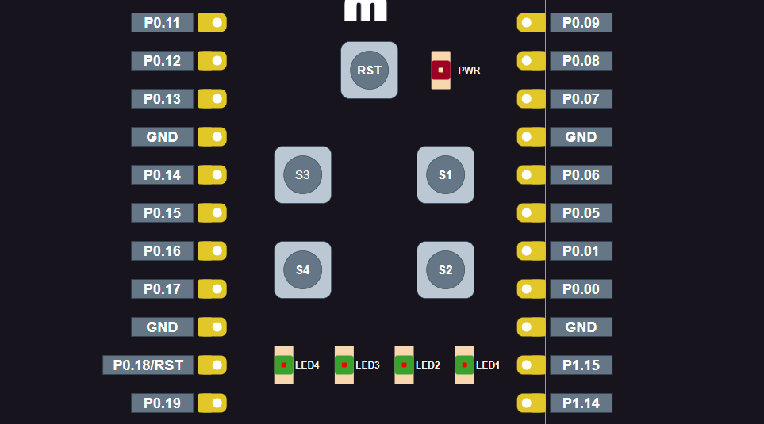

# NUBOOT Flashing Guide: Using J-Link and Usage Instructions

This document provides a step-by-step guide to flash NUBOOT using J-Link and usage instructions for the NU40 Dev kit.
>**Note:** This step is only necessary if your NU40 Dev kit is bricked. All Nucode products are pre-flashed with a bootloader and thoroughly tested before shipping.

## 📋 Prerequisites
### 🛠️ Hardware
- [J-Link debug probes](https://www.segger.com/products/debug-probes/j-link/)
- NU40-B-Dev02 Development Kit
### 💻 Software
- [nRF Programmer](https://github.com/NordicSemiconductor/pc-nrfconnect-programmer) (The app is installed from nRF Connect for Desktop. For detailed steps, see [Installing nRF Connect for Desktop apps](https://docs.nordicsemi.com/bundle/nrf-connect-desktop/page/installing_apps.html) in the nRF Connect for Desktop documentation.)
- [Pre-Built nuboot for NU40-B-Dev02](../../releases/nuboot_nu40bdevkit_v1_0.hex)
- [mcumgr tool](https://github.com/apache/mynewt-mcumgr)
  
## ⏭️ Steps to Flash NUBOOT

1. **Connect J-Link to NU40-B-Dev02**
    - Connect J-Link to NU40-B-Dev02 over the SWD port following the picture below:
  
  

    - Double-check that the wiring connections are correct, particularly the GND and VCC.
    - Plug J-Link into your computer.
    - Verify that the power LED (LED5) is on.

1. **Launch nRF Programmer**
    - Open the Programmer from *nRF Connect for Desktop* software on your computer.
    - Select the target device from the list of connected devices.

2. **Load NUBOOT Firmware**
    - In the nRF Programmer software, click on "**Add file**" and navigate to "**Browse..**".
    - Browse to the location of the `nuboot_nu40bdevkit_version.hex` firmware file and select it.

3. **Flash the Firmware**
    - Click on the "**Erase & write**" button in the nRF Programmer software to start the flashing process.
    - Wait for the process to complete.

4. **Verify the Flashing Process**
    - After the flashing process completes, confirm that the firmware has been successfully flashed by following these steps:
        - Press and hold button S1.
        - While holding button S1, press the reset button.
        - Check if LED1 turns on, which indicates that the device has entered recovery mode successfully.

## 🛠️ Troubleshooting
  - Ensure that the J-Link driver is installed.
  - Ensure that the J-Link hardware is properly connected to the target device.

## 💻 Firmware Programming with NuBoot

Follow these steps to program your firmware using NuBoot.
### 1. 🛠️ Prepare Compatible Firmware
Build the application using the following command:
```sh
west build -b $BOARD_NAME -p -- -DCONFIG_BOOTLOADER_MCUBOOT=y
```

### 2. 🔄 Enter Recovery Mode
- Connect the board to your computer via USB.
- Hold button S1 (P0.11) before powering up or while pressing the reset button.
  
  

### 3. 🔍 Identify COM Port
Open Device Manager (Windows) and locate the board's COM port under "USB Serial Device."

### 4. ⚙️ Configure `mcumgr`
Add a connection using the detected COM port:
```sh
mcumgr conn add connection_name type="serial" connstring="dev=COM8,baud=115200,mtu=512"
```
*(Replace `COM8` with the actual COM port.)*

### 5. 📤 Flash Firmware
Upload the new firmware image:
```sh
mcumgr -c connection_name image upload .\build\zephyr\app_update.bin
```
> Note: Only `app_update.bin` is supported for flashing.

### 6. 🔄 Apply Firmware
Reset the device to apply the new firmware:
```sh
mcumgr -c connection_name reset
```
Or press the reset button.

## 📚 Additional Resources

For more information and advanced usage, refer to the following resources:
- [MCUboot Project](https://github.com/mcu-tools/mcuboot)
- [Contact support from Nucode](mailto:nghia.huu@easypcb.vn)

